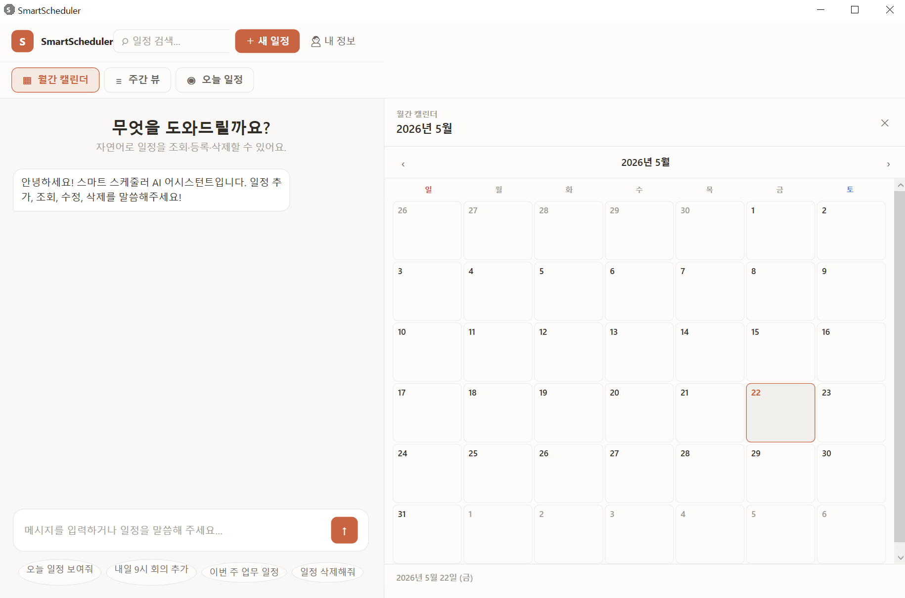
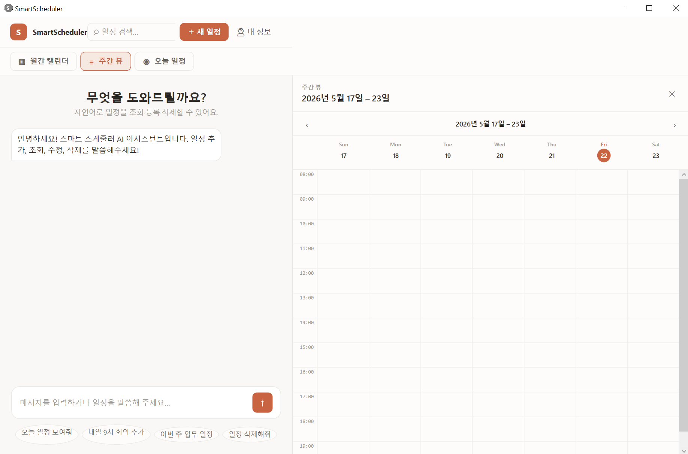
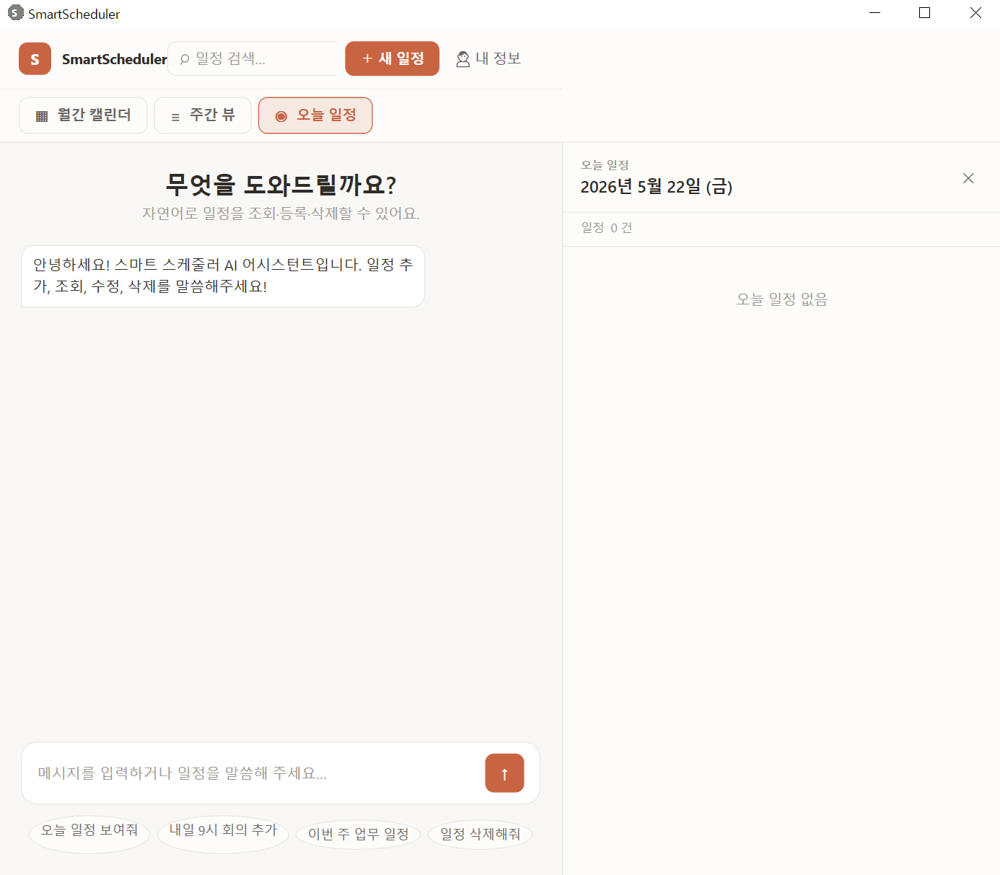
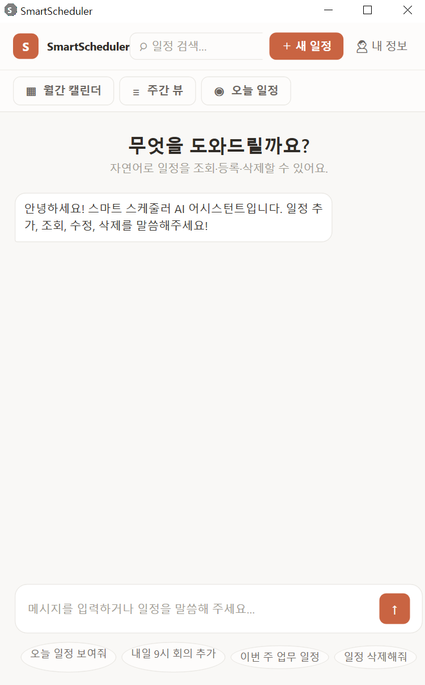

# Smart Scheduler (스마트 스케줄러)

> **Gemini 3.1 Flash와 함께하는 AI 기반의 똑똑한 일정 관리 비서**  
> 자연스러운 한국어 대화로 일정을 추가, 수정, 조회하고, 개인화된 브리핑과 다정한 AI 알림을 받아보세요. 본 프로젝트는 WPF(.NET 8.0)와 SQLite를 기반으로 개발된 지능형 스케줄러 애플리케이션입니다.

---

## UI & 인터페이스

Smart Scheduler는 사용자 친화적인 레이아웃과 부드러운 애니메이션을 탑재하여 세련된 디자인을 제공합니다. 아래 이미지는 실제 동작하는 UI 화면입니다.

| **월간 캘린더 뷰 (Monthly)** | **주간 일정 뷰 (Weekly)** |
| :---: | :---: |
|  |  |
| 전체적인 한 달 일정을 카테고리별 색상으로 파악 | 요일별 시간 흐름에 따른 상세 일정 시각화 |

| **일간 브리핑 & 일정 (Daily)** | **AI 스마트 챗 (AI Chat)** |
| :---: | :---: |
|  |  |
| 오늘 하루의 타임라인과 비서의 맞춤형 TMI 브리핑 | 자연어 대화로 일정 자동 관리 (Function Calling) |

---

## 핵심 기능 (Key Features)

### 1. Gemini 기반 AI 스마트 어시스턴트 (Function Calling)
* **말로 하는 일정 관리:** 복잡하게 버튼을 누르며 입력할 필요 없이, 비서에게 편하게 채팅으로 지시하세요.
  * *예: "내일 오후 3시에 강남역에서 부장님과 미팅 일정 등록해줘"* -> **add_schedule**이 작동해 제목, 날짜, 시간, 카테고리, 위치 정보를 정확히 파악하여 즉시 등록합니다.
  * *예: "내일 무슨 일정이 있지?"* -> **get_schedules**를 통해 등록된 일정을 조회하여 읽어줍니다.
  * *예: "아까 등록한 부장님 미팅 시간을 오후 4시로 변경해줘"* -> **update_schedule**을 통해 특정 일정을 찾아 스마트하게 수정합니다.
* **수다스럽고 다정한 비서:** 사용자의 정보(관심사, 직업 등)를 기억하여 친근한 어조로 TMI(가벼운 수다, 조언 등)를 섞어 대답해 줍니다.

### 2. 맞춤형 '오늘의 데일리 브리핑'
* 애플리케이션을 실행하거나 일간 뷰를 열면, AI 비서가 사용자를 위한 아주 길고 풍성한 브리핑 메시지를 생성합니다.
* 오늘 예정된 일정을 단순히 나열하는 데 그치지 않고, 사용자의 **프로필(직업, 관심사, 이름 등)**과 분위기에 맞추어 따뜻한 응원의 메시지와 다양한 제안(날씨 조언, 가벼운 대화 등)을 건냅니다.

### 3. AI 맞춤형 스마트 알림 (Smart Alert Popup)
* 백그라운드에서 30초마다 일정을 자동으로 체크합니다.
* 일정이 임박했을 때(예: 시작 10분 전) 세련된 스타일의 알림 창(`AlertWindow`)이 발생합니다.
* API Key가 설정되어 있는 경우, Gemini가 해당 일정을 분석하여 기계적인 문구 대신 **"성주님! 오늘 오후 3시에 있는 강남역 미팅이 벌써 10분 앞으로 다가왔어요! 늦지 않게 조심히 준비해 가세요! 파이팅입니다~"** 같은 고도로 다정하고 감성적인 메시지를 즉석에서 생성하여 알립니다.

### 4. 감속 애니메이션 & 반응형 레이아웃
* 활성화되는 패널(AI Chat 전용, 일간 전용, 월간/주간 확장)에 따라 윈도우 크기가 동적으로 전환됩니다.
* WPF의 `CubicEase` 감속 애니메이션을 활용하여 윈도우 너비가 스무스하게 늘어나거나 줄어들어 사용자 경험(UX)의 완성도를 크게 높였습니다.

### 5. SQLite 로컬 데이터베이스 및 자동 마이그레이션
* 복잡한 서버 구축 없이, 사용자의 로컬 환경(`%LocalAppData%\SmartScheduler\schedules.db`)에 데이터를 안전하게 저장합니다.
* 앱 구동 시 데이터베이스 테이블 및 필수 컬럼들이 존재하지 않으면 자동으로 테이블을 생성하고 컬럼을 추가하는 자가 복구형 마이그레이션을 지원합니다.

---

## 기술 스택 (Tech Stack)

* **프레임워크:** .NET 8.0 (WPF - Windows Presentation Foundation)
* **아키텍처 패턴:** MVVM (CommunityToolkit.Mvvm 8.4.2 활용)
* **로컬 DB:** Microsoft.Data.Sqlite (SQLite 10.0.7)
* **인공지능 API:** Google Gemini 3.1 Flash Lite API (`gemini-3.1-flash-lite`)
* **설정 관리:** JSON 기반 데이터 모델 및 직렬화 파일 입출력

---

## 시작하기 (Getting Started)

### 요구사항 (Prerequisites)
* Windows OS
* [.NET 8.0 SDK](https://dotnet.microsoft.com/download/dotnet/8.0) 이상 설치

### 설치 및 빌드 방법
1. **Google AI Studio 에서 API KEY 발급**

2. **SmartScheduler.exe 파일 실행**

---

## 설정 가이드 (Configuration)

### Gemini API Key 적용 방법
1. [Google AI Studio](https://aistudio.google.com/)에서 무료 또는 종량제 **Gemini API Key**를 발급받습니다.
2. 애플리케이션 우측 상단의 **'내 정보'** 버튼을 클릭하거나, AI 챗 화면의 **API 키 입력창**에 발급받은 키를 등록합니다.
3. API 키가 등록되면 AI 챗, 맞춤형 데일리 브리핑, 감성 알림 팝업 등 모든 스마트 기능이 활성화됩니다.

### 개인 프로필 등록
* 사용자의 **이름, 직업, 관심사** 등을 지정할 수 있습니다.
* 등록된 정보는 Gemini의 프롬프트와 연결되어 비서가 더욱 맞춤형이고 밀접하게 다가갈 수 있도록 도와줍니다.

---

## 프로젝트 구조 (Directory Structure)

```text
SmartScheduler/
├── Models/              # 데이터 엔티티 모델 (Schedule, UserProfile 등)
├── ViewModels/          # 비즈니스 로직 및 바인딩 데이터 (AiChatViewModel, MainViewModel 등)
├── Views/               # XAML 파일 및 Window 객체들 (AlertWindow, UserProfileWindow 등)
├── Services/            # 핵심 서비스 레이어
│   ├── DatabaseService.cs     # SQLite CRUD 및 쿼리 오퍼레이션
│   ├── GeminiService.cs       # Gemini API 요청, 파싱, 알림 및 브리핑 생성
│   ├── NotificationService.cs # 일정 체크 및 백그라운드 타이머 스케줄러
│   └── SettingsService.cs     # API 키 및 프로필 JSON 영속화 관리
├── Assets/              # 앱 아이콘 및 리소스
├── App.xaml             # 애플리케이션 시작 및 리소스 딕셔너리
└── MainWindow.xaml      # 메인 캘린더 및 채팅 전체 레이아웃
```

---

## 라이선스 (License)

This project is licensed under the MIT License - see the LICENSE file for details.
